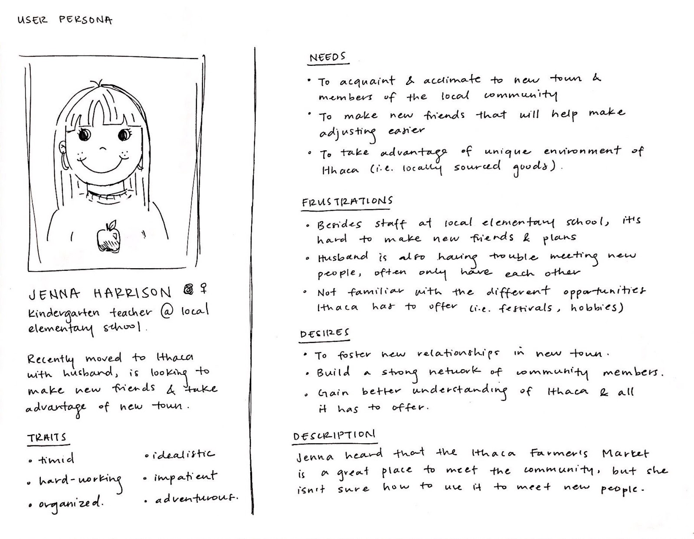

# Milestone 2: Discovery & Exploration

~~## User Groups~~

~~* Patrons of Ithaca Farmer’s Market~~
~~* ***Subset.*** Groups (couples, friends, etc.)~~
~~* ***Theme.*** Leveraging connections or groups of people to encourage group visits to the farmer’s market.~~

## Gathering Information

~~### Questions~~
~~* (Later) Whether or not they’re attending market alone or in a group~~
~~* Frequent patron?~~
~~* If so, do they typically attend alone or in a group?~~
~~* Why attend the farmer’s market? What do they like to do?~~
~~* What’s the appeal in comparison to other stores/markets?~~
~~* Do you interact or connect with the vendors or members of the Ithaca community?~~
~~* Can you walk me through how you plan to go to the farmer’s market?~~
~~* What tools or applications do you use?~~
~~* Have you bumped into anyone you know here today?~~
~~* Do you think that people you know go to the farmer’s market?~~
~~* Do you usually see people you recognize? Or join other groups? Interact?~~
~~* Have you made any close friends at the farmers market in the past?~~
~~* How did you make friends at the farmer’s market? (ask for a story)~~

~~### Process~~
~~* Going to the farmer’s market and interviewing patrons~~
~~* Will also conduct field study by observing visitors and vendors~~
    
~~### Interview Dates (@ Farmer’s Market)~~
~~* Toby (Saturday) [9:00am-3:00pm]~~
    ~~* Accompanying: Ally~~
~~* Morgan (Sunday) [10:00am-3:00pm]~~
    ~~* Accompanying: Jiayi Xu, Mengxue~~

### Methodology [Edited 11/09/2019]
Our information gathering process began with a brainstorming of potential problem spheres that might be featured at the farmers market. In narrowing down our focus to the social aspects, it allowed us to generate an outline of interview questions to ask when we visited. Since we were a group of 5, we decided to split up into two teams and conduct our information gathering sessions on both saturday and sunday. Below is a screenshot of our pre-research notes:

At the farmers market, we conducted multiple methods of information gathering to achieve a hollistic perspective of the social climate. On Saturday we conducted semi-structured interviews based loosely on the previously generated list of topics. We believed it would be best to utilize semi-structured interviews as it suited the casual nature of the farmer's market while also allowed for unique insight into the large problem scope of social interactions. These finidings were supplemented by samples of quantitative data, as we counted how many people were entering/leaving the market as individuals vs. groups, while also taking note of how large the size of each group was. On Sunday, we once again conducted semi-structured interviews but at a lesser depth and with more people. We decided to to vary the depth between the two days as we wanted to capture as much of the general population as possible while still allowing time to dive into individual concerns. These were supplemented by field study observations of interactions. Below are some artifacts, and notes from our trips to the farmer's market.

Information and data collected from both trips were then summarized below and shared with the rest of the group. 

### User Interviews
* *Stall owner.*
    * Has been at farmer’s market regularly for many years. 
    * Sees several customers regularly, but most are new week-to-week. 
    * They have noticed that most who come alone are very driven by shopping, and are often not interested in chatting.
* *Cornell parent, visiting his son.*
    * Student has expressed interest in coming to the farmer’s market, but does not have transportation.
* *Couple who visits market when in town.*
    * Enjoy the local-ness.
    * Only come together to the farmer’s market.
* *Man wandering alone.*
    * Usually comes with his wife, sometimes with other friends if he can find people. 
    * Doesn’t usually plan trips, just decides to come and wander. 
    * He is most interested in food.
* *Cornell Math professor and Caltech visiting professor.*
    * Math professor comes every week for groceries and usually comes alone; came with visiting professor this week, but that’s more situational and not something that happens routinely.
    * Math professor says that Wegman’s and other similar large supermarkets are overwhelming because there’s so many options, whereas at the farmer’s market, it’s more familiar and they can visit the same vendors on a weekly basis. Visits co-ops otherwise.
    * Caltech visiting professor said everything at the farmer’s market looks more appealing than stuff in grocery stores.
    * Math professor said she feels like most people in the Ithaca community come to the farmer’s market and will typically see people they recognize like co*workers. Doesn’t speak to people unless they’re already acquainted, even vendors who they regularly visit.
    * Math professor doesn’t really make new friends at the farmer’s market – seems to come for more of a functional purpose that has become habitual.

### Field Study Observations
* Many more groups than individuals
* Small groups tend to stick together, not often intermingling
* Stallkeepers only ever engage with one group at a time
* Within a 5 minute span, how many entering/leaving were individuals vs. groups
    * **Individual:** 7
    * **Group:** 15
* Within a 5 minute span, what was the size of the group
    * **1 person:** 7
    * **2 people:** 13
    * **3 people:** 1
    * **4 people:** 4
    * **5 people:** 1

### Affinity Diagrams [Edited 11/09/2019]

As a method of organizing the interview data, we generated an affinity diagrams to further narrow down our project scope.

As can be seen in the diagram, the users sets easily sorted into two groups. Those who were goal oriented at the farmers market, versus those who were with the purpose of discovering food, product, and produce options.

### Executive Summary of Findings [Edited 11/09/2019]

Ultimately, in the process of analyzing and organizing our collected information, we arrived at 3 key findings that best represent the user's needs/goals.
1) Non-goal-oriented visitors of the farmers market need something to guide their discovery of the various offerings at the market. There are so many different options, it can often be overwhelming to choose.
2) Goal-oriented visitors need a way to expand outside of their comfort zone and venture into different stalls.
3) Vendors and visitors often do not converse lengthily, no matter if they are goal-oriented or non-goal-oriented customers.

## Problems [Edited 11/09/2019]

~~* Parking~~
~~* Changing stalls make it hard to know what’s available~~

Primary Problem
* **Hard to build connections with other people**
    * Vendor-Customer vs customer-customer relationships
    * Groups tend to be insular
    * Some people are more task oriented, whereas others have a flexible schedule
    * Visitors who come to the farmer’s market routinely as opposed to those who visit based on circumstances and situation

Secondary Problem
* Difficulty in choosing which stall to visit
    * frequent visitors often go to the same stalls consistently
    * newcomers have too many options to choose from and not enough information on products

## Value Propositions [Edited 12/04/2019]

~~We hope to improve the Ithaca Farmer’s Market experience by creating connections among the community of patrons. The problem we are attempting to address is how it’s “hard to build connections with other people” at the farmer’s market. This will add value to the market by: **(1)** better understanding where an individual’s food comes from, and **(2)** joy from forming close relationships.~~
  
~~***Better understanding of where an individual’s food comes from.*** The sharing of food knowledge happens among both vendor-to-patron and patron-to-patron relationships. Fostering new connections between people at the market empowers patrons to have a better sense of how the market runs and what products are in season. These connections may also encourage new and existing members of the Ithaca community to enjoy the farmer’s market.~~

~~***Joy from forming close relationships.*** People are social in nature. The farmer’s market creates an environment where people can support each other. When this occurs, a certain joy is attained within each individual. These values are not only limited to inter*customer interactions, but also benefits the vendors as well. By creating a friendlier environment, vendors are more able to share their passions behind the products they are providing.~~

We hope to improve the Ithaca Farmer’s Market experience by provoking novel social interactions within the community. Our PWA aims to address our main problem by helping build connections with other people, all the while providing a gateway for customers to visit new stalls. In using our PWA, we hope to add value to the market by: **(1)** giving joy in forming close relationships, and **(2)** introducing exciting novel recipes for visitors to incorporate into their daily lives.

***Joy from forming close relationships*** People are social in nature. When pairing the intimate nature of a farmer's market with the motivation of a scavenger hunt, visitors are united by a shared goal completing the task before them. Not only are intra-customer interactions encouraged, but customer-vender interactions are facilitated as well. In having customers converse with vendors more, they could have a better understanding of where their food comes from and thus a better appreciation of the goods they consume. Furthermore, the joy received from forming close relationships has a knock-on effect, as the community would strengthen and become a environment where people can support each other.

***Introduces novel recipes*** One recurring problem found throughout multiple interviews was that people were easily flooded by the myriad of options at the farmer's market and would simply resolve to just going to the same stalls over and over again. Our PWA tackles this by introducing novel recipes to visitors, thus giving users a reason to visit a variety of stalls. These novel recipes are also saved on their app, and thus can provide exciting adventures to attempt in their own kitchen. If the thrill of novelty is not encouragement enough, users also gain to complete these recipes as it helps them fill out punch cards which provide  discounts in future purchases.

Although it the value that this PWA brings to the farmer's market is clearly evident, there still remains barriers to adopting this tool into one's routine. For example, this may not be the most attractive option to those who attend the farmer's market with a goal-oriented approach. Another cost to of adopting this application is that the recipes may be limited. Since we are only providing 3 recipes each week, users may feel dissuaded if the options do not match their preference.

There are no direct alternatives to this PWA, but there exists other options for its individual features. For example, people could look up thousands of recipes online through various sources. Furthermore, they could specify specific food interests that they are attempting to explore. That being said, our team believes that this PWA still has the potential to thrive regardless of the alternatives as it provides a unique goal-oriented approach towards exploring local produce and goods.

## Scenarios [Edited 12/04/2019]

~~***Scenario 1.*** Having grown up in Ithaca, Valentin is a regular at the farmer’s market. He attends every week, and knows exactly which stall has the best cabbage. His visits at the farmer’s market are very goal-oriented, as he purchases his weekly produce there on a habitual basis. Elaine on the other hand feels intimidated by the wide range of options that the market provides. She is trying to buy cabbage, but there are a multitude of stalls that are all offering slight variations of the same vegetable. Elaine needs to form a connection with Valentin in order to better understand her cabbages, to ultimately make a decision on which to buy.~~

~~***Scenario 2.*** Genevieve, a math professor at Cornell, is having a really rough week. She’s swamped with grading exams, completing her research, and writing grant proposals; all this has left her stressed and lonely. She would like to break this rhythm and get off campus. Newlyweds, Jim and Jane, are also professors at Cornell. Lately they have been arguing, and are getting a bit sick of each other. They’re used to going to the farmer’s market together, but can’t imagine spending that much time alone together. Jim and Jane would love some company, but don’t know if any of their friends or colleagues are interested in going. They need to find one another with the shared interest of the farmer’s market in order to alleviate their personal issues.~~

~~***Scenario 3.*** Trey is a local gardener who sometimes sells wild flowers at the farmer’s market. Teresa is an artist who often works with flowers in many of her sculptures. Teresa normally buys her flowers at Tops, having never considered the farmer’s market as a potential place to buy. Teresa is organizing a flower arrangement workshop event, and doesn’t know of other flower enthusiasts to help program this event. She needs a way to connect to Trey as a partner in hosting the event.~~

***Scenario 1.*** Jenna, a teacher at the local Ithaca elementary school, is attending a potluck this weekend. She doesn't have the time to cook, but would love to bring a dish that is intimate and made in Ithaca. She has never been to the farmer's market, but was told that it was a good place not only for produce but cooked foods as well. When she gets there, she is flooded by the many options that are available. Jenna needs to find a way to narrow down her options while still providing a genuine "home-cooked" style meal for the potluck tonight.

***Scenario 2.*** Josh is frequent visitor of the farmers market and has completed many of the home-cooked meal recipes that the PWA has to offer. It is his 1 year anniversary with his wife and he promised to make her a home-cooked meal. He recalls that she really fancied the salmon dish he made a couple months ago, but can't remember the recipe and ingredients off the top of his head, only remembering that it was a suggested recipe from the farmer's market. Josh needs to find the recipe and its ingredients for the meal he will be serving tonight.

***Scenario 3.*** Trey and Teresa, two high school students, have only recently began using the PWA. However, since they've picked it up he has become obsessed with collecting different badges and claiming the discounts provided when completing a punch card. They are both on their 5th stamp at Ally's farm, and are 1 stamp away from receiving the free gift of in-season garlic. Out of the three provided recipes, they don't know which to choose to succesfully complete and claim the final stamp needed. They need help finding which recipe has ingredients from Ally's farm and to claim that last stamp.

## Persona [Edited 12/05/2019]

~~***Jenna.*** Our persona is an elementary school teacher at the local Ithaca elementary school. She recently moved to Ithaca with her husband Jack. Jenna is excited to start a new life in such a cute little town, and she really enjoys locally-sourced goods, niche festivals and events, picking up new hobbies, and close-knit communities. In herOne of her co-workers at the school told her about the Ithaca Farmer’s Market, and how many members of the Ithaca community visit the market on the weekends. However, Jenna feels hesitant because she doesn’t know much about the community or the people. She doesn’t know where to start building these new relationships in this new town, and her husband is just as lost.~~

***Jenna.*** Our persona is an elementary school teacher at the local Ithaca elementary school. She recently moved to Ithaca with her husband Jack. Jenna is excited to start a new life in such a cute little town, and she really enjoys locally-sourced goods, niche festivals and events, picking up new hobbies, and close-knit communities. One of her co-workers at the school told her about the Ithaca Farmer’s Market; this piques her interest as she regularly used to visit the one in her hometown. Since the town was small, the community was really tight knit since all the vendors were neighors or friends who lived not far away. Back there, she was always updated with what was in season or when specific produce was in harvest. However since coming to Ithaca, she feels hesitant to go because she doesn’t know much about the community or the people. She doesn’t know how to pick from the myriad of stalls here, and has no idea where to start building these new relationships in this new town.

## Theme [Edited 12/05/2019]

***Building a community.*** The ultimate theme of our project is to strengthen and grow the farmers market community. Based on research, it seems like patrons typically don’t spend time to connect with vendors of the farmer’s market despite those who regularly visit the same stalls. Facilitating these relationships could strengthen the Ithaca community by building a network of new connections. In this case, this goal is accomplished through interactions within the participants of the farmer’s market, encompassing both patron-patron relationships as well as vendor-patron relationships. 

***Making visits to the Ithaca Farmer's Market a fun experience.*** Novelty is often paired with excitement. When repeatedly doing something on schedule, even something as fun as going to the Farmer's market can get boring sometimes. Our goal is to ensure that every trip to there will not be exactly the same as the last. By varying the social interactions and sprinkling treats of surprise, the farmer's market transforms from a weekly task to a weekly event.